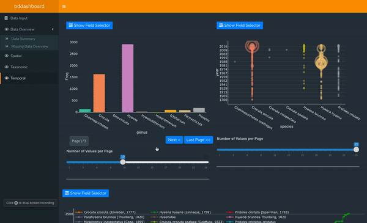
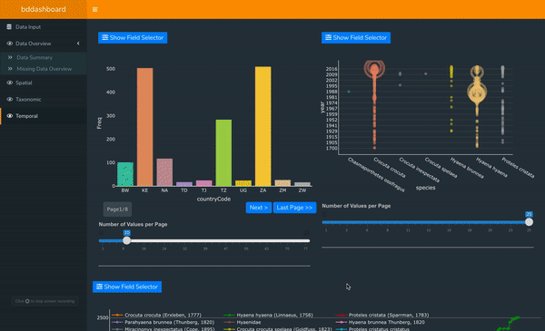
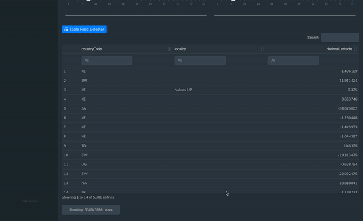
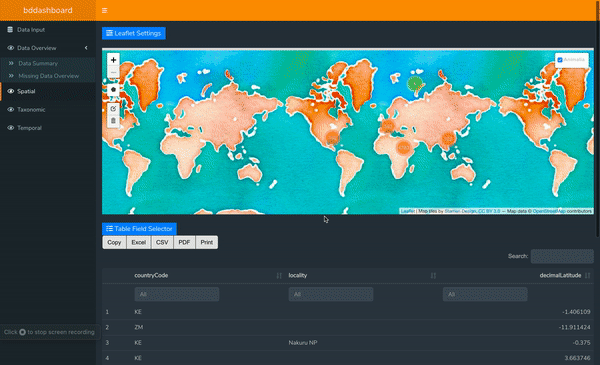
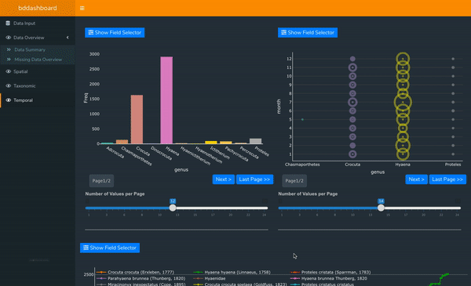
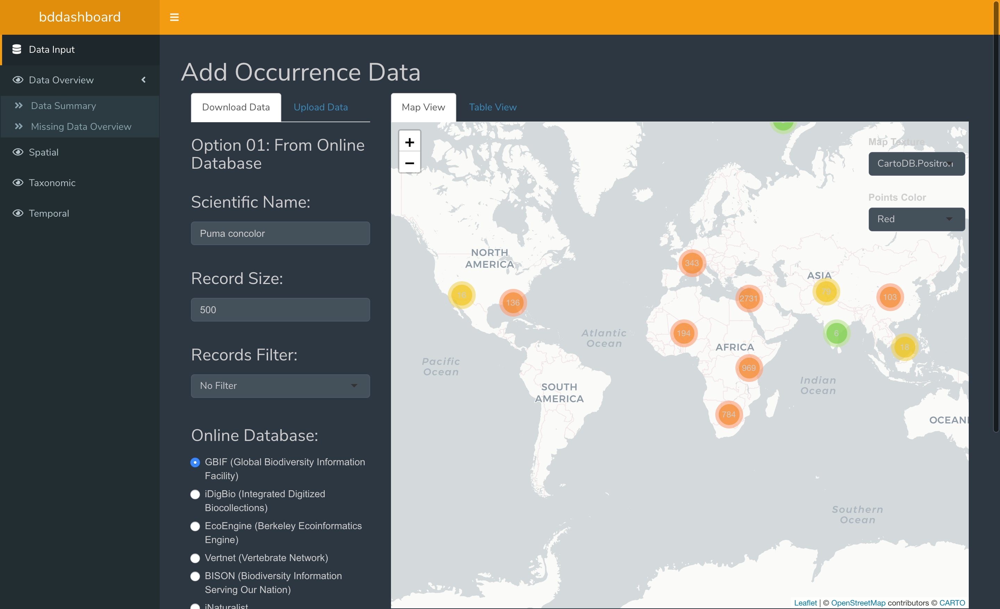
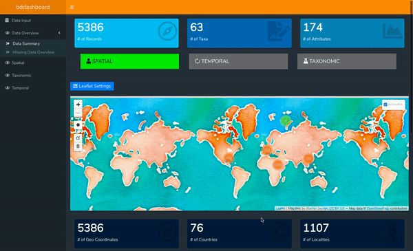
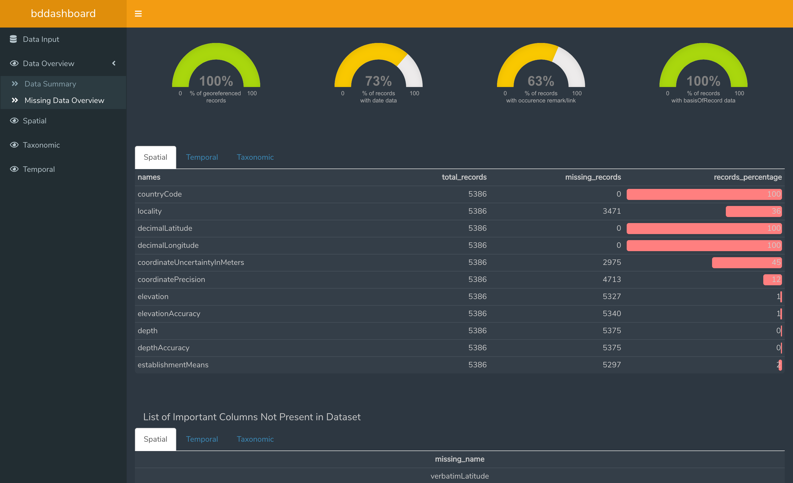
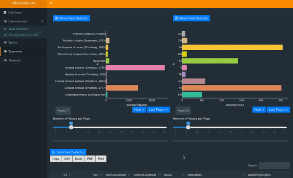

<!-- README.md is generated from README.Rmd. Please edit that file -->

# dashboard.demo

<!-- badges: start -->

[](https://www.tidyverse.org/lifecycle/#experimental)

<!-- badges: end -->

The bdverse is a family of R packages that allow users to conveniently employ R, for biodiversity data exploration, quality assessment (QA), data cleaning, and standardization.

The Idea of this project is to add to bdverse a package that will allow users to visualize biodiversity data using interactive and reactive shiny elements with drilling-down capabilities and execute further exploration analysis. 

This package, includes different modules that make it reusable and allows user to create their own interactive and reactive dashboard within few minutes


## Installation

You can install the development version of dashboard.demo from
[GitHub](https://github.com/) with:

``` r
# install.packages("devtools")
devtools::install_github("bd-R/dashboard.experiment")
```

``` r
library("dashboard.experiment)
```

## Using dashboard.demo

Follow these steps to run dashboard.demo

``` r
dashboard.experiment::run_app()
## Run the code to open dashboard.demoexperiment
```

## Modules Overview

### Reactivity

Reactivity creates the illusion that changes in input values automatically flow to the plots, text, and tables that use the input—and cause them to update.

In other words, reactive plots are those who are connected with other plots and changes value when other plots are clicked. 

The Old method of implementing reactivity includes using event listeners on each plot and changes other plot when event is occurred. This technique works but become very complex and hard to implement when your start adding new plots. 

Some packages tried to solve that issue by failed to handle large data.

Our plot module allows user to add a new plot and connect it with all the other plot on the dashboard in a reactive manner with just only 1 line of code. 

Here's the example of reactivity. Explore mod_temporal_tab.R for which uses same technique to creact 3 reactive plots.



Follow these steps to add a reactive plot.

I am assuming you are familier with shiny modules.
There are currently 4 different plots which you can use and more plot types are in testing phase and soon will be availabe.

Suppose you want to add a new bar plot. You just need to call the module in ui and server, and all the reactivity will be handled by module itself


```
# In Shiny UI

fluidPage(
    fluidRow(
        mod_plotly_bars_ui(ns("plotly_bars_ui_1"))
    )
)
```

```
# In Shiny server

data_reactive <- reactiveValues(data = data.frame(), events = list(), leaflet_data=NULL)
  
observe({
    data_reactive$data = data()
})

callModule(mod_plotly_bars_server, "plotly_bars_ui_1", data_reactive,  data, "column_name", orientation ="v")

```
where ```data``` is your actual dataset

### Field Selectors

Field sector is a special module that makes our modules universal. Every visualization dashboard have different data, every combintion of columns/fields tells different story on plot. 

Field selector allows user to change the X, Y-axis on plots, columns to be visible on table and some settings of leaflet allow. All that in real time without reloading the page or disturbing the reactivity.

Field selector automatically detects, how many columns does plot needs and what columns can be passed to X-axis and what can be passed to Y-axis. 

All plots, DT, and leaflet bddashboard comes with field selector built in, but to make them work properly, you need a dictionary file, which divides data into diffent categories. Look dictionary.rda inside data folder for structure.

Field Selector also tells you what percentage of that column contains values, i.e not null

#### Plot Field Selector




#### Table Field Selector




#### Map Field Selector




### Plot Navigation

Navigation is a module I implemented to prevent edge cases. It is possible to draw 1000 bars on a single bar plot but not possible for human to understand that. Sometimes, it make more sence to look only perticular piece of infomation.

Navigation allows user to decide how many values he wants to see on a single plot. 
For example there, maybe 100 different bars on a bar plot. User can use the slider to change how many bars he want to see. If he select 10 on the slider, then plot is devided into 10 pages, each showing 10 bars. There are navigation buttons that will automatically popups when needed.

This technique also allows to draw very large data fast.
Without disturbing the reactivity of the page.




Well thats all about the module. Altough bddashboard is made to visualize biodiversity data, these modules will allow user to create their own dashboard. Without worrying about complexity of coding.

dashboard.experiment is tries to show world how easy it become now to create a dashboard.

## dashboard.experiment Overview


### DataInput Tab

DataInput tab is dedicated for dataset selection. Fill required fields and click on query Database to download records. User can also upload their own dataset.



### Data Summary

DataSummary tab is made to give an overview of your dataset before
visualization. User can click on each tab to get summary of related fields.





### Missing Data Tab

This tab helps user to get % of missing records. Each tab contains related columns.




### Spatial Tab

Spatial Tab is dedicated to space related visualizations such as
location, countries, etc. If you want to see data of a perticular
country, click on bar of that country. After that Aaa other plots will
show data collected from that country only. Note: Double click at black
area of bar chart to reset all graphs.


### Taxonomic Tab

Taxonomic Tab is designed to visualize the taxonomy of data. Two bar graphs are used to filter the records. Select column of your choice and then click on records you want to filter data with.





### Temporal Tab

This tab is to visualize time related data. 


## We need your feedback :innocent:

We have tested this dashboard and all the modules with 1M data records. But bugs are part of programming. If you face any issue, please notify me.

Please submit your feedback using this **[link](https://github.com/rahulchauhan049/dashboard.experiment/issues/new)**

   :deciduous_tree: :mushroom: :shell: :fish: :frog: :honeybee: :turtle: :rooster: :whale2: :monkey: :octocat: 
